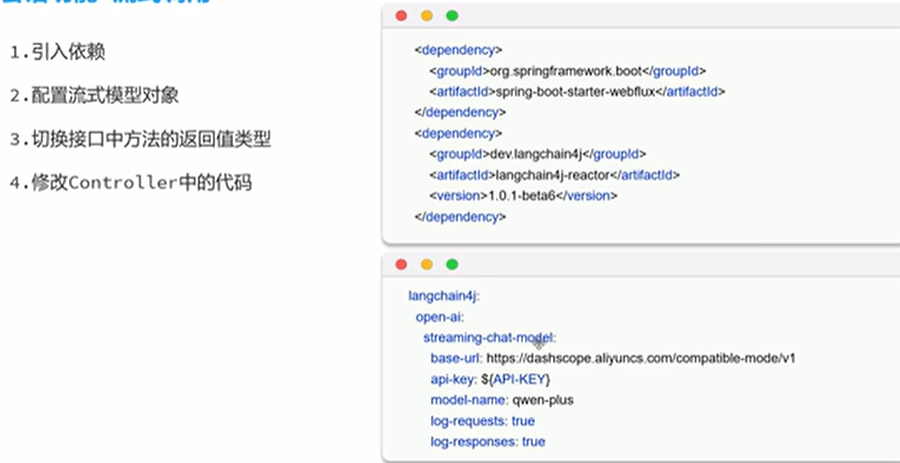

# Langchain4j

## 会话功能

### 快速入门

```java
public class App {
    public static void main(String[] args) {
        OpenAiChatModel model = OpenAiChatModel.builder()
                .baseUrl("http://localhost:11434/v1")
                .apiKey("ollama") // Ollama 不需要，但 LangChain4j 需要非空
                .modelName("qwen3:1.7b") // ✅ 使用已下载的模型名，包括参数
                .logRequests(true)
                .build();

        String result = model.chat("你叫什么名字?");
        System.out.println(result);
    }
}
```

### spring整合Langchain4j

引入库，yaml设置

```yml
langchain4j:
  open-ai:
    chat-model:
      base-url: 
      api-key: 
      model-name: 
      log-requests: true
      log-responses: true
```

### AiService 工具类

```java
@AiService(
        wiringMode = AiServiceWiringMode.EXPLICIT,//手动装配
        chatModel = "openAiChatModel",//指定模型
        ……
)
```

### 流式调用



### 消息注解

`@SystemMessage`

`@UserMessage`

```java
//    @SystemMessage("")
    @SystemMessage(fromResource = "system.txt")
//@UserMessage("你是一只小猪{{it}}" )
//@UserMessage("你是一只小猪{{msg}}" )
// public Flux<String> chat(@V("msg") String message);
    public Flux<String> chat(String message);
```

### 会话记忆

#### 会话记忆

```java
    @Bean
    public ChatMemory chatMemory() {
        MessageWindowChatMemory memory = MessageWindowChatMemory.builder()
                .maxMessages(20)
                .build();
        return memory;
    }
```

#### 会话记忆隔离


```java
   //构建ChatMemoryProvider对象
    @Bean
    public ChatMemoryProvider chatMemoryProvider(){
        ChatMemoryProvider chatMemoryProvider = new ChatMemoryProvider() {
            @Override
            public ChatMemory get(Object memoryId) {
                return MessageWindowChatMemory.builder()
                        .id(memoryId)
                        .maxMessages(20)
                        .build();
            }
        };
        return chatMemoryProvider;
    }
```

#### 会话记忆持久化

`docker run -d --name redis -p 6379:6379 redis`

```java
package com.lihui.langchain4j_ai_demo.repository;

import dev.langchain4j.data.message.ChatMessage;
import dev.langchain4j.data.message.ChatMessageDeserializer;
import dev.langchain4j.data.message.ChatMessageSerializer;
import dev.langchain4j.store.memory.chat.ChatMemoryStore;
import org.springframework.beans.factory.annotation.Autowired;
import org.springframework.data.redis.core.StringRedisTemplate;
import org.springframework.stereotype.Repository;

import java.time.Duration;
import java.util.List;

@Repository
public class RedisChatMemoryStore implements ChatMemoryStore {
    //注入RedisTemplate
    @Autowired
    private StringRedisTemplate redisTemplate;

    /*
    * 获取会话消息
     */
    @Override
    public List<ChatMessage> getMessages(Object memoryId) {
        //获取会话消息
        String json = redisTemplate.opsForValue().get(memoryId);
        //把json字符串转化成List<ChatMessage>
        List<ChatMessage> list = ChatMessageDeserializer.messagesFromJson(json);
        return list;
    }

    /*
    * 更新会话消息
     */
    @Override
    public void updateMessages(Object memoryId, List<ChatMessage> list) {
        //更新会话消息
        //1.把list转换成json数据
        String json = ChatMessageSerializer.messagesToJson(list);
        //2.把json数据存储到redis中
        redisTemplate.opsForValue().set(memoryId.toString(), json, Duration.ofDays(1));
    }

    /*
    * 删除会话消息
     */
    @Override
    public void deleteMessages(Object memoryId) {
        redisTemplate.delete(memoryId.toString());
    }
}

```

```java
 //构建ChatMemoryProvider对象
    @Bean
    public ChatMemoryProvider chatMemoryProvider() {
        ChatMemoryProvider chatMemoryProvider = new ChatMemoryProvider() {
            @Override
            public ChatMemory get(Object memoryId) {
                return MessageWindowChatMemory.builder()
                        .id(memoryId)
                        .chatMemoryStore(redisChatMemoryStore)
                        .maxMessages(20)
                        .build();
            }
        };
        return chatMemoryProvider;
    }

```

## RAG知识库

### 原理

RAG,Retrieval Augmented Generation,检索增强生成。通过检索外部知识库的方式增强大模型的生成能力


### 快速入门

#### 存储（构建向量数据库操作对象）


```java
//构建向量数据库操作对象
@Bean
public EmbeddingStore store() {//embeddingStore的对象, 这个对象的名字不能重复,所以这里使用store
    //1.加载文档进内存
    List<Document> documents = ClassPathDocumentLoader.loadDocuments("content");
    //2.构建向量数据库操作对象  操作的是内存版本的向量数据库
    InMemoryEmbeddingStore store = new InMemoryEmbeddingStore();

    //3.构建一个EmbeddingStoreIngestor对象,完成文本数据切割,向量化, 存储
    EmbeddingStoreIngestor ingestor = EmbeddingStoreIngestor.builder()
            .embeddingStore(store)
            .build();
    ingestor.ingest(documents);
    return store;
}
```

#### 检索（构建向量数据库检索对象）

```java
 //构建向量数据库检索对象
    @Bean
    public ContentRetriever contentRetriever(EmbeddingStore store) {
        return EmbeddingStoreContentRetriever.builder()
                .embeddingStore(store)
                .minScore(0.5)
                .maxResults(3)
                .build();
    }
```

### 核心API

#### 文档加载器

用于将磁盘或者网络中的数据加载进程序

- FileSystemDocumentLoader  => 根据本地磁盘绝对路径加载
- ClassPathDocumentLoader => 相对路径加载
- UrlDocumentLoader => 根据Url路径加载

#### 文档解析器

- TextDocumentParser，解析纯文本格式的文件
- ApachePdfBoxDocumentParser，解析pdf格式文件
- ApachePoiDocumentParser，解析微软的office文件，例如DoC、PPT等
- ApacheTikaDocumentParser（默认），几乎可以解析所有格式的文件

#### 文档分隔器

DocuemntByParagraphSplitter，按照段落分割文本

DocumentByLineSplitter，按照行分割文本

DocumentBySentenceSplitter，按照句子分割文本

DocumentByWordSplitter，按照词分割文本

DocumentByCharacterSplitter，按照固定数量的字符分割文本

DocumentByRegexSplitter，按照正则表达式分割文本

DocumentSplitters.recursive(...)（默认），递归分割器，优先段落分割，再按照行分割，再按照句子分割，再按照词分割

#### 向量模型

EmbeddingStoreIngestor

配置使用自己的vector存储

## Tools工具

### 准备工作

准备工作：开发一个预约信息服务，可以读写MySql中预约表中的信息

正常的数据库设计 以及相关的CRUD

### 原理


### 实现

`@Tool`  描述方法作用

`@P` 描述方法的参数

