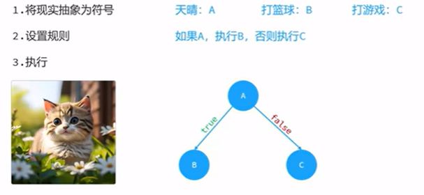
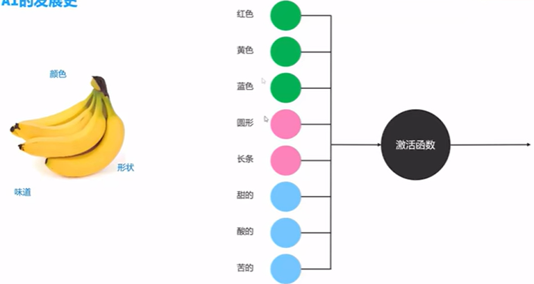
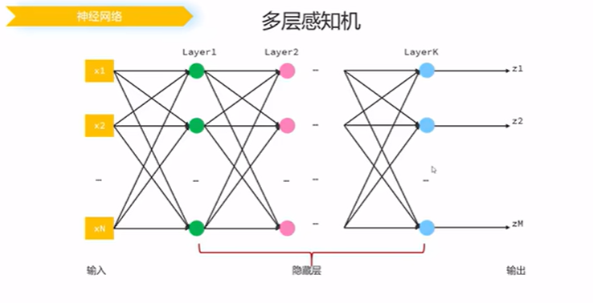
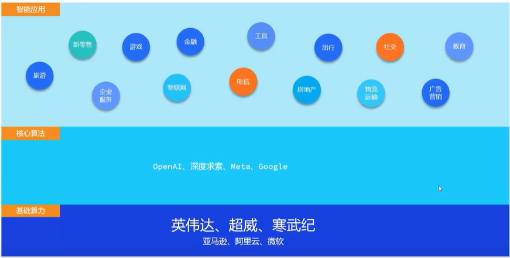

# langchain4j介绍

## 认识ai

符号主义 =>  连接主义(感知机、二分类)=>神经网络（多层感知机）





## AI市场分布



## 模型部署与模型参数

### 模型部署

采用ollama

### 模型参数（常见）

```js
curl http://localhost:11434/api/chat -d '{
  "model": "deepseek-r1",
  "messages": [
    {
      "role": "user",
      "content": "how many r in the word strawberry?"
    }
  ],
  "think": true,
  "stream": false
}'
```

1. model  => 模型
2. messages => 发给模型的数据
   1. content：消息
   2. role：角色（user 用户 ，system 系统 assistant 模型响应）
3. stream =>调用方式（默认false）
   1. true：非阻塞调用 （流式）
   2. fasle 阻塞调用（一次响应）
4. enable_search=>联网搜索 启用后 模型会将搜索结果作为参考信息
   1. true
   2. false（默认）